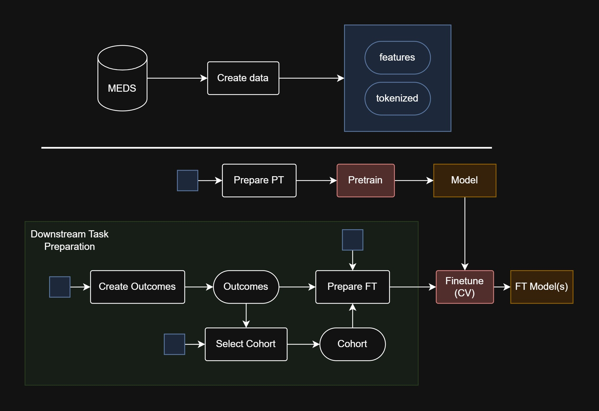

# COREBEHRT

[](https://github.com/FGA-DIKU/EHR/actions/workflows/pipeline.yml)
[](https://github.com/FGA-DIKU/EHR/actions/workflows/unittests.yml)
[](https://github.com/FGA-DIKU/EHR/actions/workflows/format.yml)
[](https://github.com/FGA-DIKU/EHR/actions/workflows/lint.yml)


> **A framework for processing and analyzing Electronic Health Records (EHR) data using BERT-based models.**

COREBEHRT helps researchers and data scientists preprocess EHR data, train models, and generate outcomes for downstream clinical predictions and analyses.

---

## Table of Contents

- [COREBEHRT](#corebehrt)
  - [Table of Contents](#table-of-contents)
  - [Key Features](#key-features)
  - [Directory Overview](#directory-overview)
  - [Getting Started](#getting-started)
    - [Virtual Environment Setup](#virtual-environment-setup)
  - [Pipeline](#pipeline)
    - [Converting to MEDS](#converting-to-meds)
    - [1. Create Data](#1-create-data)
    - [2. Pretrain](#2-pretrain)
    - [3. Create Outcomes](#3-create-outcomes)
    - [3.1 Create Cohort](#31-create-cohort)
    - [4. Finetune](#4-finetune)
  - [Azure Integration](#azure-integration)
  - [Contributing](#contributing)
  - [License](#license)
  - [Citation](#citation)

---

## Key Features

- **End-to-end EHR Pipeline**: Tools for data ingestion, cleaning, and feature extraction.
- **BERT-based Modeling**: Pretraining on massive EHR corpora followed by task-specific finetuning.
- **Cohort Management**: Flexible inclusion/exclusion logic, temporal alignment, outcome definition.
- **Scalable**: Designed to run both locally or on cloud infrastructure (Azure).
- **Built-in Validation**: Cross-validation and out-of-time evaluation strategies.

---

## Directory Overview

Below is a high-level overview of the most important directories:

- **main**: Primary pipeline scripts (create_data, pretrain, finetune, etc.)
- **modules**: Core implementation of model architecture and data processing ([detailed overview](corebehrt/modules/overview.md))
- **configs**: YAML configuration files for each pipeline stage
- **functional**: Pure utility functions supporting module operations ([detailed overview](corebehrt/functional/overview.md))
- **azure**: Cloud deployment and execution utilities ([azure instructions](corebehrt/azure/README.md))

## Getting Started

### Virtual Environment Setup

For running tests and pipelines, create and activate a virtual environment, then install the required dependencies:

```bash
python -m venv .venv
source .venv/bin/activate
(.venv) pip install -r requirements.txt
```

## Pipeline



Below is a high-level description of the steps in the COREBEHRT pipeline. For detailed configuration options, see the [main README](corebehrt/main/README.md).
The pipeline can be run from the root directory by executing the following commands:

```bash
(.venv) python -m corebehrt.main.create_data
(.venv) python -m corebehrt.main.prepare_training_data --config_path corebehrt/configs/prepare_pretrain.yaml
(.venv) python -m corebehrt.main.pretrain
(.venv) python -m corebehrt.main.create_outcomes
(.venv) python -m corebehrt.main.select_cohort
(.venv) python -m corebehrt.main.prepare_training_data --config_path corebehrt/configs/prepare_finetune.yaml
(.venv) python -m corebehrt.main.finetune_cv
(.venv) python -m corebehrt.main.select_cohort --config_path corebehrt/configs/select_cohort_held_out.yaml
(.venv) python -m corebehrt.main.prepare_training_data --config_path corebehrt/configs/prepare_held_out.yaml
(.venv) python -m corebehrt.main.evaluate_finetune --config_path corebehrt/configs/evaluate_finetune.yaml
```

### Converting to MEDS

Before using COREBEHRT, you need to convert your raw healthcare data into the [MEDS (Medical-Event-Data-Standard) format](https://github.com/Medical-Event-Data-Standard/meds) format. We provide a companion tool [ehr2meds](https://github.com/FGA-DIKU/ehr2meds) to help with this conversion:

- Converts source data (e.g., hospital EHR dumps, registry data) into MEDS
- Performs code normalization and standardization
- Provides configuration options for handling different data sources
- Includes validation to ensure data quality

### 1. Create Data

- **Goal**: Convert **MEDS** into **tokenized features** suitable for model training.
- **Key Tasks**:
  - **Vocabulary Mapping**: Translates raw medical concepts (e.g., diagnoses, procedures) into numerical tokens.
  - **Temporal Alignment**: Converts timestamps into relative positions (e.g., hours or days from an index date).
  - **Incorporate Background Variables**: Incorporates static features such as age, gender, or other demographics.
- **Efficient Output**: Produces a structured parquet format that can be rapidly loaded in subsequent steps.

### 2. Pretrain

- **Goal**: Train a ModernBERT model via masked language modeling.
- **Key Tasks**:
  - Large scale self-supervised training on EHR sequences
  - Embedding temporal relationships between medical events
  - Saves checkpoints for downstream finetuning

### 3. Create Outcomes

- **Goal**: Generate outcomes from the formatted data for supervised learning.
- **Key Tasks**:
  - Search for specific concepts (medications, diagnoses, procedures) in the data
  - Optionally create exposure definitions for more complex study designs

### 3.1 Create Cohort

- **Goal**: Define the study population
- **Key Tasks**:

  - Apply inclusion/exclusion criteria (e.g. age, prior outcomes)
  - Generate index dates for each patient
  - Produce folds and test set for cross-validation

### 4. Finetune

- **Goal**: Adapt the pretrained model for specific binary outcomes
- **Key Tasks**:
  - K-fold cross-validation
  - Includes early stopping and evaluation on test set

For a detailed overview of the pipeline, see the [main README](corebehrt/main/README.md).

## Azure Integration

For running COREBEHRT on Azure cloud infrastructure using SDK v2, refer to the [Azure guide](corebehrt/azure/README.md). This includes:

- Configuration setup for Azure
- Data store management
- Job execution in the cloud
- Environment preparation

## Contributing

We welcome contributions! Please see our [Contributing Guidelines](CONTRIBUTING.md) for details on:

- Code style and formatting
- Testing requirements
- Pull request process
- Issue reporting

## License

This project is licensed under the MIT License - see the [LICENSE](LICENSE) file for details.

## Citation

If you use COREBEHRT in your research, please cite the following paper:

```bibtex
```
