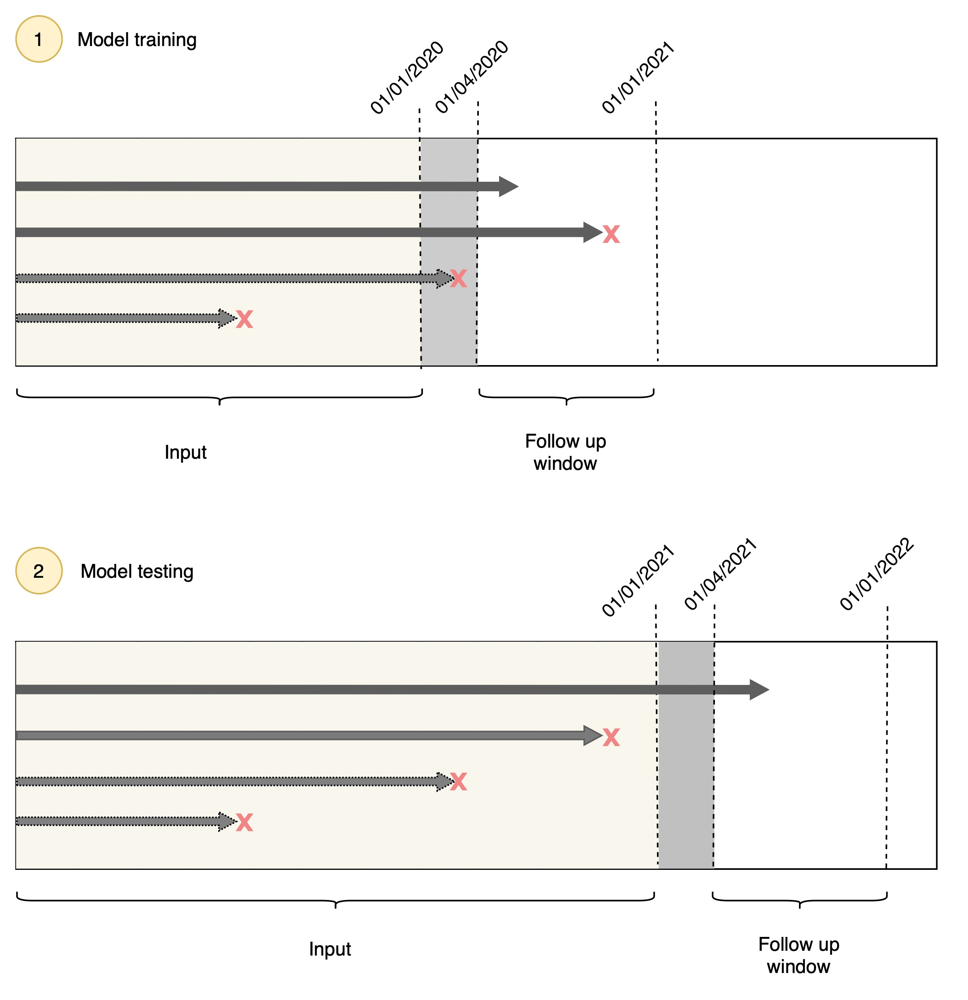

---
<<<<<<< HEAD
title: 'BONSAI: A framework for processing and analysing Electronic Health Records (EHR) data using transformer-based models'
=======
title: 'xxx: A framework for processing and analysing Electronic Health Records (EHR) data using BERT-based models'
>>>>>>> 0e4c8a8 (draft for joss paper)
tags:
    - Python
    - EHR
    - BERT
    - healthcare
    - machine learning
authors:
  - name: Maria Montgomery
    orcid: 0009-0000-3809-0513
    equal-contrib: true
    affiliation: 1 
  - name: Kiril Klein
<<<<<<< HEAD
    orcid: 0000-0001-8779-0209
    equal-contrib: true
    affiliation: 1 
  - name: Mikkel Odgaard
    orcid: 0000-0002-9072-0874
    equal-contrib: true
    affiliation: 1 
  - name: Stephan Lorenzen
    orcid: 0000-0001-6701-3752
    equal-contrib: true
    affiliation: 1 
  - name: Zahra Sobhaninia
    orcid: 
    affiliation: 1 
affiliations:
 - name: Copenhagen University, Denmark
   index: 1
date: 23 June 2025
=======
    orcid: 
    equal-contrib: true
    affiliation: 1 
- name: Mikkel Odgaard
    orcid: 
    equal-contrib: true
    affiliation: 1 
- name: Stephan Lorenzen
    orcid: 
    equal-contrib: true
    affiliation: 1 
- name: Zahra Sobhaninia
    orcid: 
    equal-contrib: true
    affiliation: 1 

affiliations:
 - name: Copenhagen University, Denmark
   index: 1
date: 20 June 2025
>>>>>>> 0e4c8a8 (draft for joss paper)
bibliography: paper.bib
---

# Summary 
<<<<<<< HEAD
BONSAI is an end-to-end Python framework for processing and analysing Electronic Health Records (EHR) data. It extends the model described in the CORE-BEHRT paper [@odgaard2024core] and is designed to streamline data preparation, model pre-training, and fine-tuning for patient-level prediction tasks. The framework is built for efficient large-scale processing of EHR data, making it suitable for clinical applications involving substantial volumes of patient record. 
=======
xxx is an end-to-end Python framework for processing and analysing Electronic Health Records (EHR) data. It extends the model described in the CORE-BEHRT paper [@odgaard2024core] and is designed to streamline data preparation, model pre-training, and fine-tuning for patient-level prediction tasks.
>>>>>>> 0e4c8a8 (draft for joss paper)

The framework accepts EHR data in the MEDS format [@kolo2024meds], performs comprehensive preprocessing, and prepares the data for BERT-based modeling, following the structure of the BEHRT model [@li2020behrt]. This includes converting raw EHR data into tokenised inputs by mapping vocabulary to numerical tokens and aligning patient histories into temporally ordered sequences of medical concepts. Each concept is paired with temporal features such as visit timestamps (positions), patient age, and visit-level segment encodings. Additional static features, including date of birth (DOB), gender, and optionally date of death (DOD), are prepended to each sequence. Separator and classification tokens can be optionally included. Numeric values can be binned and added as categorical tokens. Aggregation of similar concepts is supported via regex-based grouping, and the removal of specific concepts is also included via regex.

Modeling is performed using a ModernBERT backbone [@warner2024smarter] from the Hugging Face library. Model configurations are specified via a YAML config file, with defaults provided. Pre-training uses a masked language modeling (MLM) objective with Cross-Entropy loss. Fine-tuning is performed as a binary classification task using outcome-specific labels derived from the input sequences. Cohort definition and censoring can be done in two ways: either by including all data with post-hoc censoring based on outcome dates and a user-defined window, or via a simulated prospective approach with a fixed cutoff date. The fine-tuning head consists of a BiGRU layer that encodes patient sequences into a single embedding, which is passed to a linear classification layer trained using binary cross-entropy loss and the AdamW optimizer. Optional features include the use of a learning rate scheduler and the ability to freeze pre-trained layers during fine-tuning. Finally, the pipeline also includes an evaluation script that outputs model predictions and, optionally, intermediate model embeddings.

# Statement of need
The growing adoption of foundation models in Natural Language Processing (NLP) [@devlin2019bert; @brown2020language; @touvron2023llama], coupled with the increasing availability of EHR data, has led to a surge in adapting such models to the clinical domain [@li2020behrt; @rasmy2021med; @pang2021cehr; @pang2024cehr; @gu2023mamba; @odgaard2024core]. However, existing frameworks often differ significantly in model architecture, data representations, and preprocessing steps, making comparison and reproducibility challenging. Notably, recent efforts such as the CEHR Benchmark [@pang2024cehr] have begun to standardise evaluation protocols, underscoring the diversity in approaches across the field.

<<<<<<< HEAD
BONSAI was developed to provide an end-to-end pipeline in a modular setup, enabling flexible experimentation with EHR modeling. Users can easily switch between data representations, sources, normalisation strategies, and fine-tuning heads. Although ModernBERT is the default backbone, the framework supports alternative architectures with minimal configuration changes. It also includes baseline models for comparison and supports deployment on Microsoft Azure, a platform commonly used for working with protected health data, making it practical for working with real-world clinical data.

# Figures
\autoref{fig:pipeline} depicts the overall pipeline of BONSAI. 

{width=100%}

The figures below depict the censoring scheme for the data preprocessing, where \autoref{fig:prospective_censoring} shows the censoring scheme in a prospective setup, and \autoref{fig:post_hoc_censoring} shows the censoring scheme for the post-hoc setup. 

{width=80%}

{width=80%}

# Acknowledgements
Thanks to Mads Nielsen and Martin Sillesen for data access and supervision. 
=======
xxx was developed to provide an end-to-end pipeline in a modular setup, enabling flexible experimentation with EHR modeling. Users can easily switch between data representations, sources, normalisation strategies, and fine-tuning heads. Although ModernBERT is the default backbone, the framework supports alternative architectures with minimal configuration changes. It also includes baseline models for comparison and supports deployment on Microsoft Azure, a platform commonly used for working with protected health data, making it practical for working with real-world clinical data.

# Figures
Figure \autoref{fig:pipeline} depicts the overall pipeline of xxx. 

# Acknowledgements
Thanks to Mads and Martin for data + supervision? 
>>>>>>> 0e4c8a8 (draft for joss paper)

# References